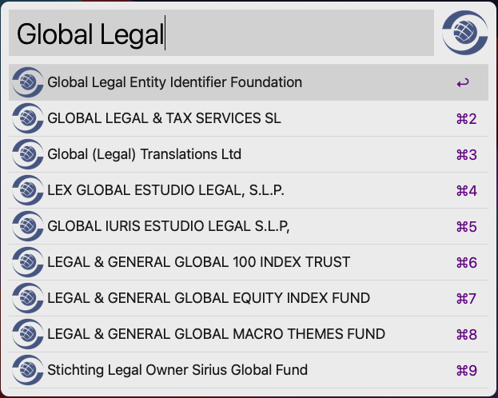
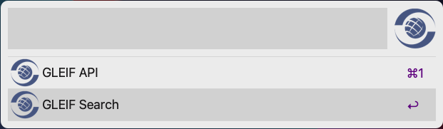

[](https://github.com/igalita/alfred-gleif-search/actions/workflows/tests.yml) [](https://github.com/igalita/alfred-gleif-search/actions/workflows/release.yml) 

# An ultra-fast [GLEIF search](https://search.gleif.org) for [Alfred](https://www.alfredapp.com/)



## Installation

1. [Download the latest version](https://github.com/igalita/alfred-gleif-search/releases)
2. Install the workflow by double-clicking the `.alfredworkflow` file
3. You can add the workflow to a category, then click *Import* to finish importing. You'll now see the workflow listed in the left sidebar of your Workflows preferences panel.

## Usage

To lookup an **Legal Entity**, open **Alfread** and type `gs` followed by your search query.

```,
gs <query>
```

Or, in Alfred Preferences click on **Workflows** > **GLEIF Search** and set a hotkey to directly open the workflow.

## Visualization options 



After selecting the **Legal Entity**, you are prompted with the options on how to view it. You can disable this behaviour by setting the `quick_open` workflow variable to either `ui` or `api`.

See the Alfred documentation on [Workflow variables](https://www.alfredapp.com/help/workflows/advanced/variables/) for more information on how to configure workflow variables.

## Configuration

You can configure how you want to visualize the **Legal Entity** details via the `quick_open` variable. You can either view **Legal Entity** details in [search.gleif.org](https://search.gleif.org) or directly in the [api.gleif.org](https://api.gleif.org).

| Value | Comment |
|-------| --------|
| `ui`  | Opens [search.gleif.org](https://search.gleif.org) |
| `api`  | Opens [api.gleif.org](https://api.gleif.org) |

## Licensing

This workflow and extension are released under the [MIT licence](./LICENSE).
